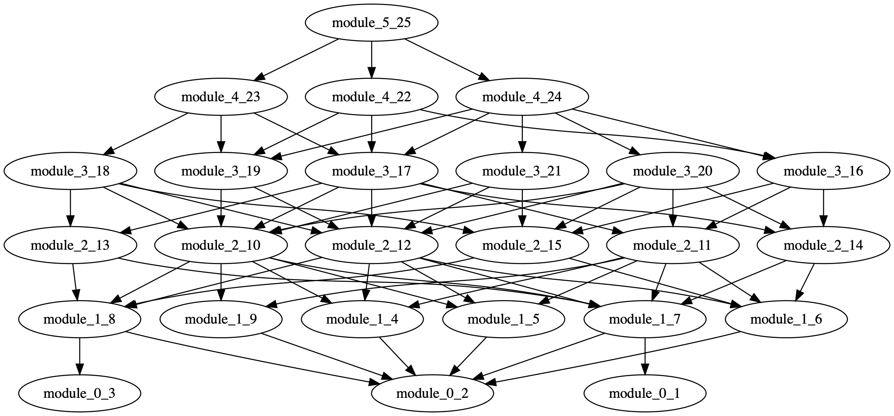
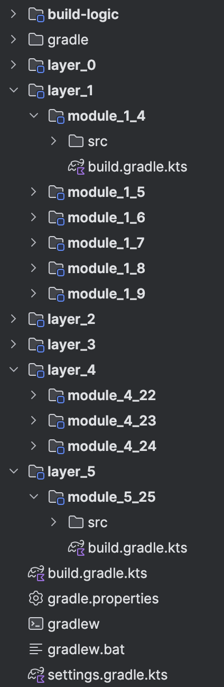

# Project Generator
CLI generating modularized Gradle projects based on different shapes
<p float="left">
  
  
</p>


# Usage
## CLI
### Install
```
curl -L https://github.com/cdsap/ProjectGenerator/releases/download/v0.2.1/projectGenerator  --output projectGenerator
chmod 0757 projectGenerator
```

### Modes

#### 1. Generate Project (default)
```bash
./projectGenerator generate-project --modules 100
```
This command generates a project with the specified shape, layers, and modules. All options below can be combined with this mode.

#### 2. Generate YAML Versions File
```bash
./projectGenerator generate-yaml-versions
```

This command generates a `versions.yaml` file template for custom dependency versions.
Then, you can use the versions.yaml in the `generate-project` command:
```
./projectGenerator generate-project --shape triangle --layers 5 --modules 100 --versions-file versions.yaml
```

### CLI Options
- `--shape`: triangle, rhombus, flat, rectangle, middle_bottleneck, inverse_triangle (default: rectangle)
- `--modules` (required): Number of modules to create
- `--layers`: Number of layers (default: 5)
- `--language`: kts (default), groovy, both
- `--type`: android (default), jvm
- `--classes-module`: Number of classes per module (default: 5)
- `--classes-module-type`: fixed (default), random
- `--type-of-string-resources`: normal (default), large
- `--generate-unit-test`: Generate unit tests (default: false)
- `--gradle`: gradle_8_2, gradle_8_5, gradle_8_9, gradle_8_13, gradle_8_14_2 (default: gradle_8_14_2)
- `--develocity`: Enable Develocity build scan plugin (default: false)
- `--versions-file`: Path to a custom YAML file with dependency versions

#### Example: Generate a project with custom options
```bash
./projectGenerator generate-project --shape rhombus --modules 50 --layers 4 --language both --type jvm --classesModule 10 --classesModuleType random --typeOfStringResources large --generateUnitTest --gradle gradle_8_9 --develocity --versionsFile ./my_versions.yaml
```

## Library
```kotlin
val modules = 50
val shape = Shape.RHOMBUS
ProjectGenerator(
    modules = 50,
    shape =shape,
    language = Language.KTS,
    typeOfProjectRequested = TypeProjectRequested.ANDROID,
    classesPerModule = ClassesPerModule(ClassesPerModuleType.FIXED, 20),
    versions = Versions(project = Project(jdk = "17")),
    typeOfStringResources = TypeOfStringResources.LARGE,
    layers = 5,
    generateUnitTest = true,
    gradle = GradleWrapper(Gradle.GRADLE_8_14_2),
    path = file.path
).write()

```
### Dependency
```
  implementation("io.github.cdsap:projectgenerator:0.2.1")
```

# Options

## `modules`
Number of modules to create in the project
## `layers`
Number of layers where the modules will be distributed.
## `shape`
Defines the shape of the project dependency graph based on the distribution of modules by layer.
Current shapes supported:
### `triangle`

### `inverse_triangle`

### `rhombus`

### `rectangle` (default)

### `flat`

### `middle_bottleneck`


## `language`
### `kts`
**default**

The project generated includes modules build scripts in Kotlin DSL
### `groovy`
The project generated includes modules build scripts in Groovy
### `both`
Two projects will be generated using Kotlin DSL and Groovy

#### Example
```kotlin
./projectGenerator  generate-project  --shape triangle --layers 5 --modules 100 --language groovy
```
## `type`
Type of project generated:
### `android`
**default**

Android project
### `jvm`
Kotlin-JVM project

#### Example
```kotlin
./projectGenerator  generate-project  --shape triangle --layers 5 --modules 100 --type jvm
```

## `Classes Module`
Classes generated per module, options:
* classes: Classes to generate per module. Default 5.
* type:
  * Fixed(default): Each module will create n classes where n represents the argument `classes`.
  * Random: Each module will create `Random.nextInt(2, classesPerModule.classes)` classes.

#### Example
```kotlin
./projectGenerator  generate-project  --shape triangle --layers 5 --modules 100 --classes-module-type random --classes-module 150
```

## String Resources type
### Normal
Each module generated includes 8 string resources in the file `strings.xml`. **Default**.

### Large
Each module generated includes 900 string resources in the file `strings.xml`

##### Example
```kotlin
./projectGenerator  generate-project  --shape triangle --layers 5 --modules 100 --type-of-string-resources large
```
## Generate Unit Test
**default false**

If enabled, each module will generate n unit tests, where n is the argument `classes`

##### Example
```kotlin
./projectGenerator  generate-project  --shape triangle --layers 5 --modules 100 --generate-unit-test true
```
## Gradle
Gradle used, versions supported:
* Gradle 8.2
* Gradle 8.5
* Gradle 8.9
* Gradle 8.13
* Gradle 8.14_2 **default**

##### Example
```kotlin
./projectGenerator  generate-project  --shape triangle --layers 5 --modules 100 --gradle 8.13
```


## Versions
Example output versions.yaml:
```yaml
project:
  develocity: 4.0.1
  jdk: 23
kotlin:
  kgp: 2.1.20
  ksp: 2.1.20-2.0.0
  coroutines: 1.7.3
  kotlinProcessor:
    processor: KSP
android:
  agp: 8.9.1
  androidxCore: 1.9.0
  appcompat: 1.7.0
  material: 1.8.0
  lifecycle: 2.7.0
  fragment: 1.6.2
  activity: 1.8.2
  constraintlayout: 2.1.4
  work: 2.10.1
  hilt: 2.56.1
  hiltAandroidx: 1.2.0
  composeBom: 2025.05.00
testing:
  junit4: 4.13.2
  junit5: 5.10.1
  truth: 1.1.5
  mockk: 1.13.9
  coreTesting: 2.2.0
  junitExt: 1.1.5
additionalSettingsPlugins:

additionalBuildGradleRootPlugins:
    - id: com.autonomousapps.dependency-analysis
      version: 2.18.999
      apply: true

```


## Libraries used
* [clikt](https://github.com/ajalt/clikt)
